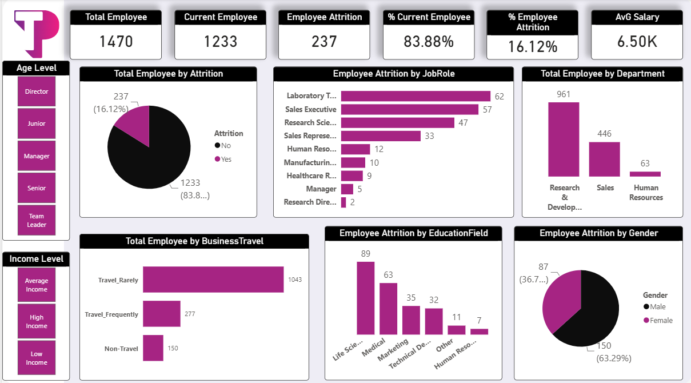

# employee-insights-dashboard

## Project Overview
This project delivers an interactive HR Analytics solution in Power BI designed to analyze workforce dynamics, monitor employee turnover (attrition), and uncover key drivers behind staff retention. By examining demographic distributions, job roles, department allocations, and compensation levels, this dashboard empowers HR leadership and management to make data-backed retention decisions.

---

## Key Features & Insights 
- **Workforce Volume:** Analyzed a total workforce of **1,470 employees**, with **1,233 active staff members** (**83.88% retention rate**).
- **Attrition Breakdown:** Evaluated **237 employee departures**, reflecting an overall **16.12% attrition rate** across the organization.
- **Departmental Distribution:** Research & Development represents the largest workforce sector (**961 employees**), followed by Sales (**446 employees**) and Human Resources (**63 employees**).
- **Job Role Vulnerability:** Attrition is heavily concentrated among operational roles: Laboratory Technicians (**62**), Sales Executives (**57**), and Research Scientists (**47**).
- **Travel Impact:** High turnover frequency correlates with business travel, where **1,043 employees** who travel rarely form the baseline workforce, alongside **277 frequent travelers**.
- **Compensation & Demographics:** Average monthly salary stands at **6.50K**, with attrition segmented across education backgrounds (*Life Sciences* and *Medical* leading) and gender (**63.3% Male / 36.7% Female** among departed staff).

---

## Tools & Techniques Used
- **Power BI Desktop:** Dynamic visualization, slicer panel integration (Age Level & Income Level), and executive dashboard layout design.
- **Power Query (ETL):** Data cleansing, handling missing values, custom column creation, and conditional grouping.
- **DAX (Data Analysis Expressions):** Calculated measures for workforce metrics (Total Employees, Active Employees, Attrition Count, Attrition Rate %, Average Salary).

---

## Dashboard Preview

---

## Project Files & Dataset
- **[Download Power BI Dashboard (Employee%20Insights%20Dashboard.pbix)](#)** 
